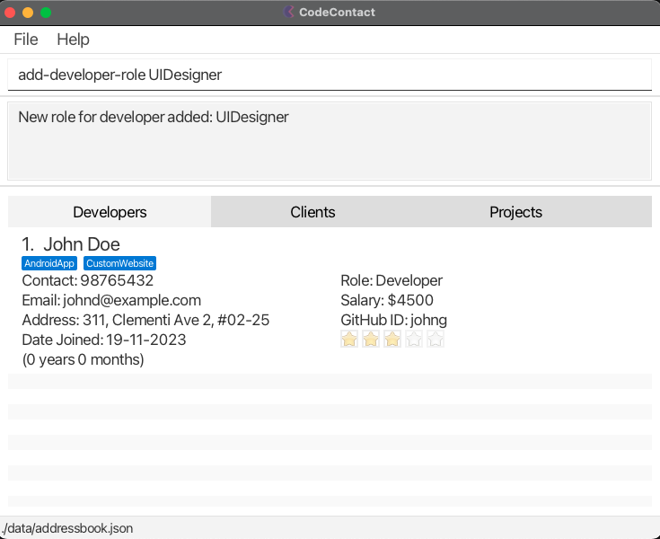
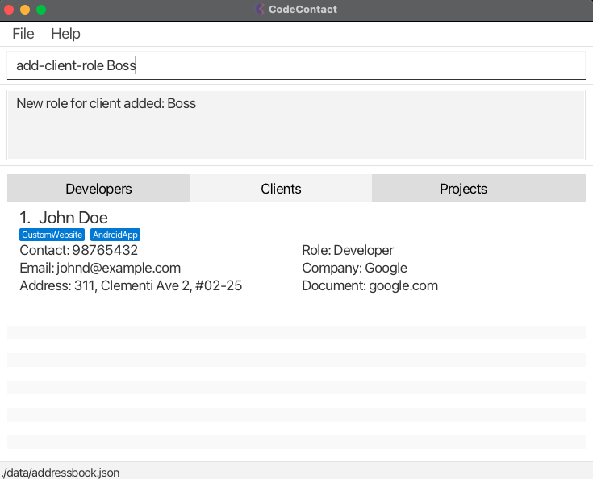
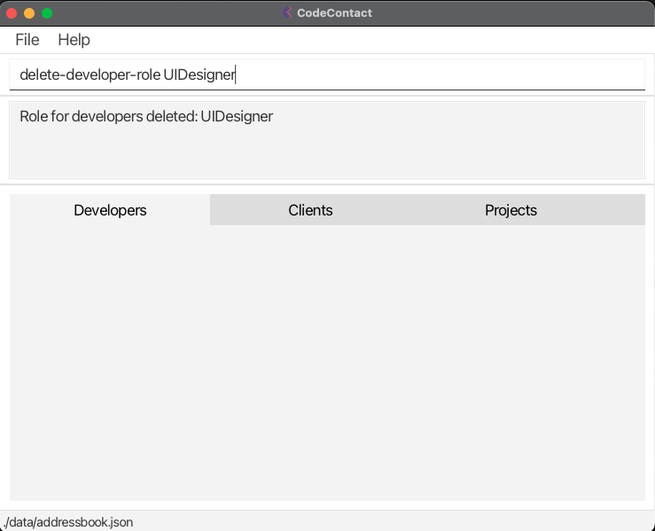
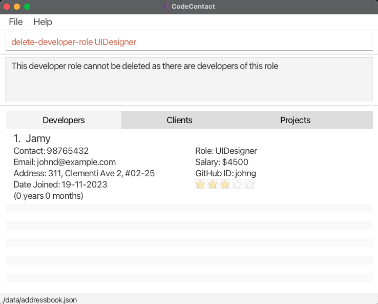
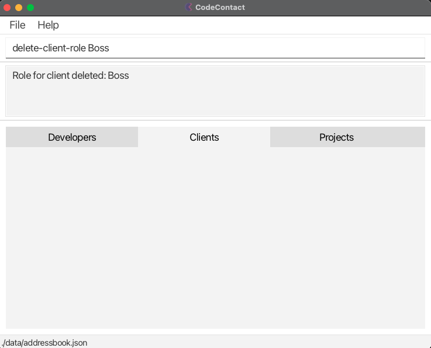
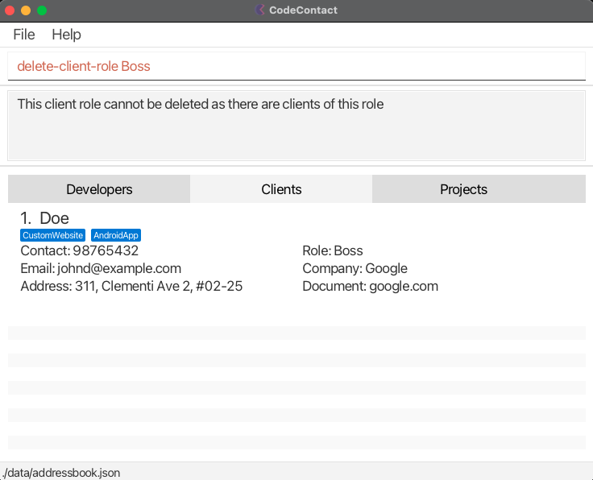
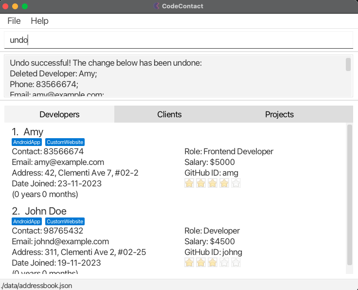
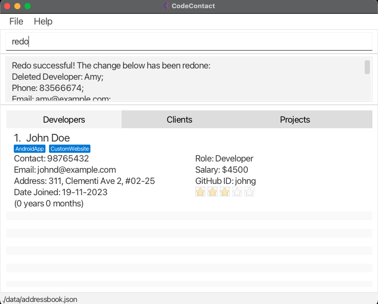

Seamlessly integrate contact, client, and project management, simplifying access to coding-related contacts,
facilitating collaboration, and offering command-line efficiency for project managers

CodeContact is a **desktop app for managing contacts, optimized for use via a Command Line Interface** (CLI) while still
having the benefits of a Graphical User Interface (GUI). If you can type fast, CodeContact can get your contact
management tasks done faster than traditional GUI apps.

## Table of Contents

* How can this guide help me?
* Navigating this guide
    * Glossary
        * Definitions
        * Parameter Information
            * Common parameters
            * Developer parameters
            * Client parameters
            * Project parameters
    * Format
        * General Formatting
        * Command Format
* Navigating the Graphical User Interface (GUI)
* [Quick Start](#quick-start)
* [CodeContact Tutorial](#codecontact-tutorial--for-new-users-)
* [Features](#features)

| Description                    |                                 Developer                                 |                              Client                              |     Project      |
|:-------------------------------|:-------------------------------------------------------------------------:|:----------------------------------------------------------------:|:----------------:|
| Adding new information         |                              `add-developer`                              |                           `add-client`                           |  `add-project`   |
| Editing information            |                             `edit-developer`                              |                          `edit-client`                           |  `edit-project`  |
| Importing information          |                            `import-developer`                             |                         `import-client`                          |        -         |
| Deleting information           |                            `delete-developer`                             |                         `delete-client`                          | `delete-project` |
| Finding information            |                             `find-developer`                              |                          `find-client`                           |  `find-project`  |
| Listing information            |                             `list-developer`                              |                          `list-client`                           |  `list-project`  |
| [Adding new role](#add-roles)  |     [`add-developer-role`](#add-developer-roles--add-developer-role)      |     [`add-client-role`](#add-client-roles--add-client-role)      |        -         |
| [Deleting role](#delete-roles) | [`delete-developer-role`](#delete-developer-roles--delete-developer-role) | [`delete-client-role`](#delete-client-roles--delete-client-role) |        -         |

* Mark deadline as done `mark-deadline`
* Mark deadline as undone `unmark-deadline`
* Find Deadline `find-deadline`
* Lock `lock`
* Unlock `unlock`
* Change password `change-password`
* [Undo `undo`](#undo--undo)
* [Redo `redo`](#redo--redo)
* [Help `help`](#viewing-help--help)
* [Clear entries `clear`](#clearing-all-entries--clear)
* [Exit program `exit`](#exiting-the-program--exit)
* [FAQ](#faq)
* [Known Issues](#known-issues)
* [Command Summary](#command-summary)

-------------------------------------------------------------------------------------

## How can this guide help me?

If you are a new user, we hope to first inform you on how you can [get started](#quick-start) using CodeContact.

As you use CodeContact, you may also have questions on how to perform certain actions within the
application. This guide thus contains a comprehensive list of [Features](#features) offered with CodeContact, as well as
explanations on when and how to use them.

Further questions are also answered within a [FAQ](#faq) section below.

Confused about the terms or formatting used in this guide? Learn how to **navigate this guide
** [here](#navigating-this-guide).

Confused about the visual display of CodeContact? Learn how to **navigate the user interface** of CodeContact
[here](#navigating-the-graphical-user-interface--gui-).
------------------------------------------------------------------------------------------

## Navigating this guide

### Glossary

### Definitions

| Term          | Definition                                                                                                                |
|---------------|---------------------------------------------------------------------------------------------------------------------------|
| Parameter     | Parameters are specific details you would include about the devloper/client/project.(eg. name, date joined, description)  |
| Command       | An input from the user that tells CodeContact to perform an action (i.e. add a client)                                    |
| GUI           | Graphical User Interface (GUI) represents the visual display of CodeContact that users can see.                           |
| GUI Component | A subsection of the Graphical User Interface. For more information on specific GUI components, refer to [this section](). |
| CLI           | Command Line Interface (CLI) represents a text-based user interface to interact with the application.                     |
| Character     | Any letter or symbol that is recognized by the computer, and can form a line of text (eg. `a` , `+` , `$` ).              |
| JSON          | [Javascript Object Notation](https://en.wikipedia.org/wiki/JSON)                                                          |
| JAR file      | [Java Archive File](https://en.wikipedia.org/wiki/JAR_(file_format))                                                      |
| CSV file      | [Comma-separated Values File](https://en.wikipedia.org/wiki/Comma-separated_values)                                       |

[Scroll back to Table of Contents](#table-of-contents)

### Parameter Information

Within the tables below, you can find out more about the parameters that CodeContact supports. These parameters come in
handy when crafting commands in CodeContact.

Here are some notes about these parameters.

* Each parameter comes with **constraints**. These constraints detail the specific formats of text that
  each parameter accepts as valid user input.
    * Not following these constraints will **result in an error** when entering the command.
      *Nonetheless, CodeContact will not stop working. Rather, a message will be provided to you on
      how to correct your command.

#### Common Parameters

| Parameter | Description                              | Constraints                                                    | Valid Examples              | Invalid Examples                            |
|-----------|------------------------------------------|----------------------------------------------------------------|-----------------------------|---------------------------------------------|
| `n/`      | name of developer/client/project         | alphanumeric characters and spaces, and it should not be blank | Tom Hanks, Elizabeth 2      | 成龍, 潔 いさぎ 世 よ 一 いち, Ganesh s/o Ravichandran |
| `p/`      | phone number of developer/client/project | numeric characters, and it should not be blank                 | 94566835                    |                                             |
| `e/`      | email of developer/client/project        | alphanumeric characters, and it should not be blank            | amy@gmail.com               |                                             |
| `a/`      | address of developer/client/project      | alphanumeric characters and spaces, and it should not be blank | 311, Clementi Ave 2, #02-25 |                                             |
| `r/`      | role of developer/client/project         | alphabetical characters and spaces, and it should not be blank | Developer                   |                                             |
| `pr/`     | project name of developer/client/project | alphanumeric characters and spaces, and it should not be blank | CS2103T                     |                                             |

#### Developer Parameters

| Parameter | Description                  | Constraints                                                                    | Valid Examples | Invalid Examples     |
|-----------|------------------------------|--------------------------------------------------------------------------------|----------------|----------------------|
| `g/`      | github username of developer | alphanumeric characters, and it should not be blank                            | johng, amy123  |                      |
| `d/`      | date joined of developer     | numeric characters in DD-MM-YYYY format, and it should not be blank            | 19-11-2023     | 19/11/2023, 1/1/2023 |
| `s/`      | salary of developer          | numeric characters, and it should not be blank                                 | 5000           |                      |
| `rt/`     | rating of developer          | numeric characters with 1 decimal place and spaces, and it should not be blank | 5.0, 3.5       | 5,3                  |

#### Client Parameters

| Parameter | Description                 | Constraints                                                    | Valid Examples | Invalid Examples |
|-----------|-----------------------------|----------------------------------------------------------------|----------------|------------------|
| `o/`      | organisation name of client | alphanumeric characters and spaces, and it should not be blank | Google         |                  |
| `do/`     | document name of client     | alphanumeric characters and spaces, and it should not be blank | google.com     |                  |

#### Project Parameters

| Parameter | Description            | Constraints                                                    | Valid Examples                                  | Invalid Examples |
|-----------|------------------------|----------------------------------------------------------------|-------------------------------------------------|------------------|
| `dr/`     | description of project | alphanumeric characters and spaces, and it should not be blank | App to allow for different juices to be ordered |                  |
| `dl/`     | deadline of project    | alphanumeric characters and spaces, and it should not be blank | 19-12-2023,Design backend,HIGH,0                |                  |

-----------------------------------------------------------------------------------------------

## Navigating the Graphical User Interface (GUI)

--------------------------------------------------------------------------------------------------------------------

## Quick start

1. Ensure you have Java `11` or above installed in your Computer.

1. Download the latest `codecontact.jar`.

1. Copy the file to the folder you want to use as the _home folder_ for your CodeContact.

1. Open a command terminal, `cd` into the folder you put the jar file in, and use the `java -jar codecontact.jar`
   command to run the application.<br>
   A GUI similar to the below should appear in a few seconds. Note how the app contains some sample data.<br>
   

1. For new users, learn to use CodeContact through our [Tutorial](#codecontact-tutorial--for-new-users-).

1. Refer to the [Features](#features) below for details of each command.

--------------------------------------------------------------------------------------------------------------------

## CodeContact Tutorial (for new users)

This is a tutorial for **first-time** CodeContact users.

1. Launch CodeContact.You may refer to the instructions [here](#quick-start)
    * On launch, CodeContact will not contain any doctor or patient records.


1. You will be asked to **enter a password** to unlock CodeContact.
    * Enter the command `unlock pw/Password123!` in the command box


1. You can **change the password** to unlock CodeContact.
    * Enter the command `change-password pw/Password123! npw/<yourNewPassword>` in the command box
    * ❗Note: You can always lock and unlock CodeContact using the `lock` and `unlock` commands


1. Let us try **adding a project** to our CodeContact.
    * Enter the
      command `add-project n/AndroidApp dr/App to allow for different juices to be ordered dl/19-12-2023,Design backend,HIGH,0 dl/25-12-2023,Design frontend,MEDIUM,0 `


1. We can then **add a developer** to our CodeContact.
    * Enter the
      command `add-developer n/John Doe p/98765432 e/johnd@example.com a/311, Clementi Ave 2, #02-25 r/Developer pr/AndroidApp s/4500 d/19-11-2023 g/johng rt/3`
    * Try adding more developers with different details for each parameter!
    * Remember to add a new project or [role](#add-roles) if you which to add new developers with other roles and
      project.


1. We can also **add a client** to our CodeContact.
    * Enter the
      command `add-client n/Amy p/88765423 e/amy@example.com a/31, Clementi Ave 6, #03-12 r/Client pr/AndroidApp o/Google do/google.com`
    * Try adding more clients with different details for each parameter!
    * Remember to add a new project or [role](#add-roles) if you which to add new client with other roles and project.


1. Let us try **editing the name** of a developer stored in CodeContact.
    * Enter the command `edit-developer 1 n/Jhonny`
    * Try editing other parameters or developers and projects too!
    * More details of what you can edit can be found [here](#edit)


1. We can also easily **find** for information in CodeContact.
    * Enter the command `find-developer n/John s/4500`
    * Try looking for other information and search with multiple parameters!
    * More details of what you can find can be found [here](#find)


1. You can always **show the full list** after finding in CodeContact.
    * Enter the command `list-developer`, `list-client` or `list-project`.


1. You can **delete developers, clients or projects** in CodeContact.
    * Enter the command `delete-developer 3` to delete the 3rd developer in CodeContact


1. If you realise that you did not delete this developer, you can undo this action in CodeContact.
    * Enter the command `undo` and it will revert your previous actions.


1. If you realise you actually want it deleted, you can redo this action in CodeContact.
    * Enter the command `redo` and it will redo your previous actions.

Congratulations! You are now ready to use CodeContact!

To view all our features, you may visit our [Features](#features) section

--------------------------------------------------------------------------------------------------------------------

## Features

<div markdown="block" class="alert alert-info">

**:information_source: Notes about the command format:**<br>

* Words in `UPPER_CASE` are the parameters to be supplied by the user.<br>
  e.g. in `add n/NAME`, `NAME` is a parameter which can be used as `add n/John Doe`.

* Items in square brackets are optional.<br>
  e.g `n/NAME [t/TAG]` can be used as `n/John Doe t/friend` or as `n/John Doe`.

* Items with `…`​ after them can be used multiple times including zero times.<br>
  e.g. `[t/TAG]…​` can be used as ` ` (i.e. 0 times), `t/friend`, `t/friend t/family` etc.

* Parameters can be in any order.<br>
  e.g. if the command specifies `n/NAME p/PHONE_NUMBER`, `p/PHONE_NUMBER n/NAME` is also acceptable.

* Extraneous parameters for commands that do not take in parameters (such as `help`, `list`, `exit` and `clear`) will be
  ignored.<br>
  e.g. if the command specifies `help 123`, it will be interpreted as `help`.

* If you are using a PDF version of this document, be careful when copying and pasting commands that span multiple lines
  as space characters surrounding line-breaks may be omitted when copied over to the application.

</div>

### Add

Project Manager can add developers, clients and projects.

#### Add Developer: `add-developer`

* Type in:
    * `add-developer`
* And populate his/her details with prefixes and fields by typing in
    * `n/NAME` for the developer's name
    * `p/PHONE_NUMBER` for the developer's phone number
    * `e/EMAIL` for the developer's email
    * `a/ADDRESS` for the developer's address
    * `r/ROLE` for the developer's assigned role
    * `pr/{PROJECT1, PROJECT2…}` for developer's assigned projects
    * `s/SALARY` for the developer's salary
    * `d/DATE_JOINED` for the date the developer joined
    * `g/GITHUBID` for the developer's githubid
    * `rt/RATING` for the assigned rating for the developer
* In the following overall format
    * `add-developer n/NAME p/PHONE_NUMBER e/EMAIL a/ADDRESS r/ROLE pr/PROJECT1 pr/PROJECT2 s/SALARY d/DATE_JOINED g/GITHUBID rt/RATING`

Example:

`add-developer n/Mahidharah p/81256788 e/aunus@nus.com a/Blk 88 Lorong 8 Serangoon Gardens, #08-88 r/Developer pr/Appollo pr/Orbital s/8880 d/20-10-2020 g/mahidharah88 rt/5.0`

* When command succeeds
    * Continuing from the above example, CLI shows:
    ```
  The following user has been added:
    New developer added: Mahidharah; 
    Phone: 81256788;
    Email: aunus@nus.com;
    Address: Blk 88 Lorong 8 Serangoon Gardens, #08-88;
    Date Joined: 20-10-2020;
    Role: Developer;
    Salary: 8880;
   Projects: AppolloOrbital
  ```
* When command fails
    * User particular's error
        * `This developer already exists in the address book`
    * Format error
        * `<PARTICULAR> should ...`
        * E.g.:  `Names can only consist of capital and small letters, spaces and hyphens.`
    * Missing particular's error (when prefixes are missing)
        * `Invalid command format!`

#### Add Client: `add-client`

* Type in:
    * `add-client`
* And populate his/her details with prefixes and fields by typing in
    * `n/NAME` for the client's name
    * `p/PHONE_NUMBER` for the client's phone number
    * `e/EMAIL` for the client's email
    * `a/ADDRESS` for the client's address
    * `r/ROLE` for the client's role in their organisation
    * `pr/{PROJECT1, PROJECT2…}` for client's assigned projects
    * `o/ORGANISATION` for the organisation the client is representing
    * `do/DOCUMENT` for the document associated with the client
* In the following overall format
    * `add-client n/NAME p/PHONE_NUMBER e/EMAIL a/ADDRESS r/ROLE pr/PROJECT1 pr/PROJECT2 o/ORGANISATION do/document`

Example:

`add-client n/Mahidharah p/81256788 e/aunus@nus.com a/Blk 88 Lorong 8 Serangoon Gardens, #08-88 r/HR pr/Appollo pr/Orbital o/Google do/google.com`

* When command succeeds
    * Continuing from the above example, CLI shows:
    ```
  New client added: Mahidharah; 
  Phone: 81256788;
  Email: aunus@nus.com;
  Address: Blk 88 Lorong 8 Serangoon Gardens, #08-88;
  Organisation: Google;
  Role: HR;
  Document: google.com;
  Projects: AppolloOrbital
  ```
* When command fails
    * User particular's error
        * `This client already exists in the address book`
    * Format error
        * `<PARTICULAR> should ...`
        * E.g.:  `Names can only consist of capital and small letters, spaces and hyphens.`
    * Missing particular's error (when prefixes are missing)
        * `Invalid command format!`

#### Add Project: `add-project`

* Type in:
    * `add-project`
* And populate its details with prefixes and fields by typing in
    * `n/NAME` for the project's name
    * `dr/DESCRIPTION` for the project's description
    * `dl/{DEADLINE1, DEADLINE2...}` for deadlines assocaterd with the project
* In the following overall format
    * `add-project n/NAME dr/DESCRIPTION dl/DEADLINE1 dl/DEADLINE2`

Example:

`add-project n/Tp dr/Team Project dl/19-12-2023,Design backend,HIGH,0 dl/21-12-2023,Design frontend,LOW,1`

* When command succeeds
    * Continuing from the above example, CLI shows:
    ```
  New project added: Tp;
  Description: Team Project;
  Deadlines:
  1. Design backend by: 19-12-2023, priority: HIGH (undone)
  2. Design frontend by: 21-12-2023, priority: LOW (done)
  ```
* When command fails
    * User particular's error
        * `This project already exists in the address book`
    * Format error
        * `<PARTICULAR> should ...`
        * E.g.:  `Names can only consist of capital and small letters, spaces and hyphens.`
    * Missing particular's error (when prefixes are missing)
        * `Invalid command format!`

### Delete

#### Delete developer details : `delete-developer`

Deletes developer in the address book.

Format: `delete-developer INDEX`

Example of usage: `delete-developer 2`

* Deletes second developer from the list

#### Delete client : `delete-client`

Deletes client in the address book.

Format: `delete-client INDEX`

Example of usage: `delete-client 3`

* Deletes third client in list.

#### Delete project details : `delete-project`

Deletes the details of an existing project in the address book.

Format: `delete-project INDEX`

Example of usage: `delete-project 2`

* Deletes second project from the list and updates developers and client detials accordingly

### Edit

#### Edit developer details : `edit-developer`

Edits the details of an existing developer in the address book.

Format: `edit-developer INDEX [n/NAME] [p/PHONE_NUMBER] [e/EMAIL] [a/ADDRESS] [d/DATE_JOINED] [r/ROLE] [s/SALARY] [pr/PROJECT_NAME]... [gh/GITHUB_ID] [ra/RATING]`

* Edits the developer at the specified `INDEX` in the currently displayed developer list.
* At least one of the optional fields must be provided.
* Existing values will be updated to the input values.
* When editing projects, the existing assigned projects of the developer will be removed ie. adding of projects is not
  cumulative.
* You can remove all the developer's projects by typing `p/` without specifying any project name after it.
* `NAME` cannot be the same as another existing developer's name in the address book.
* `PROJECT_NAME` should be the name of an existing project.

Example of usage: `edit-developer 2 p/98989898 pr/Project2 pr/Project3`

* Edits `Amy`'s phone number to `98989898` and changes the projects assigned to her to `Project2` and `Project3`.

When command succeeds, CLI shows:

```
Edited Developer: Amy
Phone: 98989898
Email: amy@u.nus.edu
Address: NUS UTOWN
Date Joined: 06-09-2023
Role: Developer
Salary: 6999
Projects: Project1, Project2
```

#### Edit client details : `edit-client`

Edits the details of an existing client in the address book.

Format: `edit-client INDEX [n/NAME] [p/PHONE_NUMBER] [e/EMAIL] [a/ADDRESS] [pr/PROJECT_NAME]...  [o/ORGANISATION]`

* Edits the client at the specified `INDEX` in the currently displayed client list.
* At least one of the optional fields must be provided.
* Existing values will be updated to the input values.
* When editing projects, the existing assigned projects of the client will be removed ie. adding of projects is not
  cumulative.
* You can remove all the client's projects by typing `p/` without specifying any project name after it.

Example of usage: `edit-client 3 e/bob@gmail.com`

* Edits `Bob`'s email to `bob@gmail.com`.

When command succeeds, CLI shows:

```
Edited Client: Bob; 
Phone: 87654321; 
Email: bob@gmail.com; 
Address: Blk 123 Banana Road; 
Organisation: Google; 
Document: google.com
Projects: ProjectA
```

#### Edit project details : `edit-project`

Edits the details of an existing project in the address book.

Format: `edit-project INDEX [desc/DESCRIPTION] [d/DEADLINE]...`

* Edits the project at the specified `INDEX` in the currently displayed project list.
* At least one of the optional fields must be provided.
* Existing values will be updated to the input values.
* When editing deadlines, the existing deadlines will be removed ie. adding of projects is not cumulative.
* You can remove all the current deadlines by typing `d/` without specifying any deadline.
* The name of a project cannot be edited.

Example of usage: `edit-project 1 dl/19-12-2023,Design backend,HIGH,0`

* Deletes existing project deadlines and adds new deadline `Design backend by: 19-12-2023, priority: HIGH (undone)`

When command succeeds, CLI shows:

```
Edited Project: JuiceApp;
Description: Juice ordering app;
Deadlines:
1. Design backend by: 19-12-2023, priority: HIGH (undone)
```

### Import information

#### Import developers `import-developer`

Takes in a CSV file and populates the internal list of developers if the file is formatted correctly

Format: `import-developer [FILENAME]`

* Note that the CSV file has to be in the same folder as the JAR file for the command to function correctly.
* The CSV file has to strictly follow the column header names and order for the import to function appropriately.
* The command will abort if any of the rows have invalid data format
* Example of valid CSV:

```
Name, Contact Number, Email, Address, Date Joined, Role, Salary, GithubId, Rating, Projects,,
faiz,87654321,faiz@u.com,utown,12-12-2020,Developer,3333,Faizgit,5,AndroidApp,ProjectB,
John,123456789,john@email.com,123 Main St,01-01-2021,Developer,4000,JohnDesigns,4,AndroidApp,ProjectB,
Sarah,987654321,sarah@email.com,456 Elm St,05-10-2019,Developer,6000,SarahManager,5,AndroidApp,ProjectB,ProjectC
Alex,555555555,alex@email.com,789 Oak St,03-01-2022,Developer,5500,AlexDev,4,AndroidApp,ProjectB,
Emily,111111111,emily@email.com,321 Pine St,08-10-2018,Developer,4800,EmilyAnalyst,4,AndroidApp,ProjectB,
Michael,999999999,michael@email.com,567 Birch St,06-03-2020,Developer,7000,MichaelEngineer,5,AndroidApp,ProjectB,
```

Example of usage: `import-developer developers.csv`

* imports `developers.csv` and adds a new developer for each row of data.

When command succeeds, CLI shows:

```
New developer added: faiz; 
Phone: 87654321; 
Email: faiz@u.com; 
Address: utown; 
Date Joined: 12-12-2020; 
Role: Developer; 
Salary: 3333; 
Projects: ProjectBAndroidApp
```

for each developer successfully added

#### Import clients `import-client`

Takes in a CSV file and populates the internal list of clients if the file is formatted correctly

Format: `import-client [FILENAME]`

* Note that the CSV file has to be in the same folder as the JAR file for the command to function correctly.
* The CSV file has to strictly follow the column header names and order for the import to function appropriately.
* The command will abort if any of the rows have invalid data format
* Example of valid CSV:

```
Name, Contact Number, Email, Address, Role, Organisation, Document, Projects,
Mahi,87554321,mahi@u.com,utown,HR,Google,docs.google.com/abd,AndroidApp,ProjectB
Jane,654321876,jane@email.com,456 Oak St,HR,Acme Corp,acme.com/docs,AndroidApp,ProjectB
Robert,987123456,robert@email.com,789 Elm St,HR,Tech Solutions,techdocs.com/123,AndroidApp,ProjectB
Maria,321987654,maria@email.com,123 Maple St,HR,Innovate Inc,innovate.com/docs,AndroidApp,
Chris,876543219,chris@email.com,567 Pine St,HR,Data Insights,datainsights.com/docs,AndroidApp,
Laura,888555555,laura@email.com,101 Birch St,HR,Software Systems,software.com/docs,AndroidApp,
```

Example of usage: `import-client clients.csv`

* imports `clients.csv` and adds a new client for each row of data.

When command succeeds, CLI shows:

```
New client added: Mahi; 
Phone: 87554321; 
Email: mahi@u.com; 
Address: utown; 
Organisation: Google; 
Role: HR; 
Document: docs.google.com/abd; 
Projects: ProjectBAndroidApp
```

for each client successfully added

### Find

#### Find developer details

Finds the details of an existing developer in the address book.

Format: `find-developer [n/NAME] [p/PHONE_NUMBER] [e/EMAIL] [a/ADDRESS] [d/DATE_JOINED] [r/ROLE] [s/SALARY] [pr/PROJECT_NAME] [gh/GITHUB_ID] [ra/RATING]`

* Finds for developers based on the attributes provided.
* At least one of the optional fields must be provided.
* Existing values will be compared to the input values, and the results will include any items that match the provided
  criteria.
* You can combine multiple attributes for a more specific search.
* The search is case-insensitive, so you can use any case for the search criteria.

Example of usage: `find-developer pr/2103T rt/5.0`

* Prints developers in 2103/T project with a 5-star rating.

When command succeeds, CLI shows:

```
This is the one developer with matching information
Amy
Contact: 98989898
Email: amy@u.nus.edu
Address: NUS UTOWN
Date Joined: 06-09-2023
Role: Senior Developer
Salary: 6999
Projects: CS2103T
Rating: 5.0 Stars
```

#### Find client details

Finds the details of an existing client in the address book.

Format: `find-client [n/NAME] [p/PHONE] [e/EMAIL] [a/ADDRESS] [o/ORGANISATION] [pr/PROJECT] [d/DOCUMENT]`

* Finds for clients based on the attributes provided.
* At least one of the optional fields must be provided.
* Existing values will be compared to the input values, and the results will include any items that match the provided
  criteria.
* You can combine multiple attributes for a more specific search.
* The search is case-insensitive, so you can use any case for the search criteria.

Example of usage: `find-client o/Google r/Senior developer`

* Prints clients from Google of the senior developer role

When command succeeds, CLI shows:

```
These are the 2 clients with matching information
John Doe
Contact: 98989898
Email: john@gmail.com
Address: Google HQ
Organisation: Google
Role: Developer
Projects: AndroidApp

Alice Tan
Contact: 98977543
Email: alice@gmail.com
Address: Google HQ
Organisation: Google
Role: Senior Developer
Projects: CustomWebsite
```

#### Find project details

Finds the details of an existing project in the address book.

Format: `find-project [pr/PROJECT_NAME] [d/DESCRIPTION] [dl/DEADLINE]`

* Finds for projects based on the attributes provided.
* At least one of the optional fields must be provided.
* Existing values will be compared to the input values, and the results will include any items that match the provided
  criteria.
* You can combine multiple attributes for a more specific search.
* The search is case-insensitive, so you can use any case for the search criteria.

Example of usage: `find-project pr/JuiceApp`

* Prints projects with the name 2103T project.

When command succeeds, CLI shows:

```
This is the one project with matching information
Edited Project: JuiceApp;
Description: Juice ordering app;
Deadlines:
1. Design backend by: 19-12-2023, priority: HIGH (undone)
```

### Deleting a developer : `delete`

Deletes the specified developer from the address book.

Format: `delete INDEX`

* Deletes the developer at the specified `INDEX`.
* The index refers to the index number shown in the displayed developer list.
* The index **must be a positive integer** 1, 2, 3, …​

Examples:

* `list` followed by `delete 2` deletes the 2nd developer in the address book.
* `find Betsy` followed by `delete 1` deletes the 1st developer in the results of the `find` command.

### Listing information : `list`

Shows a list of all developers in the address book.

Format: `list-TYPE`

* Lists the specific type of thing you are asking.

Examples of usage:`list-developer`

* Lists all the developers.

Acceptable parameters:

* `developer` to list the developers
* `client` to list the clients
* `project` to list the projects

When command succeeds, CLI shows:

```
Listed all developers
```

### Find deadlines `find-deadline`

Finds deadlines in project tab based on date and/or priority

Format: `find-deadline [d/DATE] [pri/PRIORITY]`

* When finding deadlines based on `DATE`, the project tab displays deadlines due before or on the specified date
* When finding deadlines based on `PRIORITY`, only that priority (`HIGH`,`MEDIUM`, `LOW`) deadlines are shown

Example of usage: `find-deadline d/20-11-2023 pri/MEDIUM`

* Shows deadlines due before or on `20-11-2023` and with `MEDIUM` priority.

When command succeeds, CLI shows:

```
These are the 3 projects with matching information.
```

### Lock `lock`

Locks the system by hiding all the information in the tabs on the GUI. It also disables parsing of commands
except `unlock`, `help`, and `delete`

Format: `lock`

When command succeeds, CLI shows:

```
Locked all data
```

### Unlock `unlock`

Unlocks the system by making all the information visible and allows all commands to be parsed.

Format: `unlock pw/Password123!`

* Default password is `Password123!`
* You are highly recommended to change to a diffent password

When command succeeds, CLI shows:

```
Unlocked all data
```

### Change password `change-password`

Allows for password to be changed, given the current password and new password matches criteria

Format: `change-password pw/[CURRENT_PASSWORD] npw/[NEW_PASSWORD]`

* Password must be at least 8 characters long and contain at least one digit, one lowercase letter,
  one uppercase letter, and one special character.

Example of usage: `change-password pw/Password123! npw/NewPass987!`

When command succeeds, CLI shows:

```
Password changed successfully.
```

### Add roles

#### Add developer roles : `add-developer-role`

Adds new developer roles into the system.

Format: `add-developer-role ROLE_NAME`

* Adds the ROLE_NAME to list of developer roles.
* There are 3 preset roles in the list of roles: `Frontend Developer`,`Backend Developer`,`Developer`.
* You will not be able to add a developer to a role that does not exist in this list of developer roles.

Examples of usage:`add-developer-role UIDesigner`

* Adds the UIDesigner role to list of developer roles.
* You can now add developers with UIDesigner as their roles.

When command succeeds, CLI shows:

```
New role for developer added: UIDesigner
```

Relevant UI mock-ups: <br>


#### Add client roles : `add-client-role`

Adds new client roles into the system.

Format: `add-client-role ROLE_NAME`

* Adds the ROLE_NAME to list of client roles.
* There are 4 preset roles in the list of roles: `HR`,`Manager`,`Developer`,`Client`.
* You will not be able to add a client to a role that does not exist in this list of client roles.

Examples of usage:`add-client-role Boss`

* Adds the Boss role to list of developer roles.
* You can now add clients with Boss as their roles.

When command succeeds, CLI shows:

```
New role for client added: Boss
```

Relevant UI mock-ups: <br>


### Delete roles

#### Delete developer roles : `delete-developer-role`

Delete developer roles from the system.

Format: `delete-developer-role ROLE_NAME`

* Deletes the ROLE_NAME to list of developer roles.
* There are 3 preset roles in the list of roles: `Frontend Developer`,`Backend Developer`,`Developer`. These roles
  cannot be deleted.
* You will not be able to delete a developer role if there are developers in the list with that role.

Examples of usage:`delete-developer-role UI Manager`

* Deletes the UIDesigner from the list of developer roles.
* You can no longer add developers with UIDesigner as their roles.

When command succeeds, CLI shows:

```
Role for developers deleted: UIDesigner
```

Relevant UI mock-ups: <br>
 <br>
If there are still developers with this Role:


#### Delete client roles : `delete-client-role`

Delete client roles from the system.

Format: `delete-client-role ROLE_NAME`

* Deletes the ROLE_NAME to list of developer roles.
* There are 4 preset roles in the list of roles: `HR`,`Manager`,`Developer`,`Client`. These roles cannot be deleted.
* You will not be able to delete a client role if there are clients in the list with that role.

Example of usage: `delete-client-role Boss`

* Deletes the Boss from the list of developer roles.
* You can no longer add clients with Boss as their roles.

When command succeeds, CLI shows:

```
Role for clients deleted: Boss
```

Relevant UI mock-ups: <br>
 <br>
If there are still clients with this Role:


### Mark deadline as done : `mark-deadline`

Marks the indicated deadline for the project as done.

Format: `mark-deadline PROJECT_INDEX DEADLINE_INDEX`

* `PROJECT_INDEX` and `DEADLINE_INDEX` must be valid indexes of existing projects and deadlines.

Example of usage: `mark-deadline 2 1`

* Marks the 1st deadline of the 2nd project in the currently displayed project list as done.

When command succeeds, CLI shows:

```
The deadline has been marked as completed!
```

### Mark deadline as undone : `unmark-deadline`

Marks the indicated deadline for the project as undone.

Format: `unmark-deadline PROJECT_INDEX DEADLINE_INDEX`

* `PROJECT_INDEX` and `DEADLINE_INDEX` must be valid indexes of existing projects and deadlines.

Example of usage: `unmark-deadline 2 1`

* Marks the 1st deadline of the 2nd project in the currently displayed project list as undone.

When command succeeds, CLI shows:

```
The deadline has been marked as undone!
```

### Undo : `undo`

Undo the previous command you entered.

Format: `undo`

* Each time you type undo, you move back one stage.
* If you made 5 changes and you wish to undo, you can enter the command `undo` 5 times. The system will remind you when
  you cannot undo anymore.
* `undo` works for all `edit`, `add-TYPE` and `delete` commands.
* ❗**IMPORTANT**❗ `undo` does not work for all adding and deleting role functions. Undoing an
  `add-developer-role` will not delete that role.

Examples of usage: `undo`

* You just deleted a new developer and you wish to `undo`.

When command succeeds, CLI shows:

```
Undo successful! The change below has been undone: 
Deleted Developer: Amy; 
Phone: 83566674; 
Email: amy@example.com; 
Address: 42, Clementi Ave 7, #02-2; 
Date Joined: 23-11-2023; 
Role: Frontend Developer; 
Salary: 5000; 
Projects: CustomWebsiteAndroidApp
```

Relevant UI mock-ups: <br>


### Redo : `redo`

Redo the previous command you undid.

Format: `redo`

* Each time you type redo, you move forward one stage.
* You can only `redo` if you have `undo` before.
* If you undid 5 changes and you wish to redo, you can enter the command `redo` 5 times. The system will remind you when
  you cannot redo anymore.
* `redo` works for all `edit`, `add-TYPE` and `delete` commands.
* **IMPORTANT**:exclamation `redo` does not work for all adding and deleting role functions. Redoing an
  `delete-developer-role` will not delete that role.

Examples of usage:

* You just `undo` delete developer and you wish to `redo` to add it back.
  When command succeeds, CLI shows:

```
Redo successful! The change below has been redone:
Deleted Developer: Amy; 
Phone: 83566674; 
Email: amy@example.com; 
Address: 42, Clementi Ave 7, #02-2; 
Date Joined: 23-11-2023; 
Role: Frontend Developer; 
Salary: 5000; 
Projects: CustomWebsiteAndroidApp
```

Relevant UI mock-ups: <br>


### Viewing help : `help`

Shows a message explaning how to access the help page.

Format: `help`

### Clearing all entries : `clear`

Clears all entries from the address book.

Format: `clear`

### Exiting the program : `exit`

Exits the program.

Format: `exit`

### Feedback System `[coming in v2.0]`

--------------------------------------------------------------------------------------------------------------------

## FAQ

**Q**: How do I transfer my data to another Computer?<br>
**A**: Install the app in the other computer and overwrite the empty data file it creates with the file that contains
the data of your previous AddressBook home folder.

**Q**: How can I launch CodeContact if the clicking on the JAR file does not work? <br>
**A**: There are two possible methods to launch CodeContact.
<br>

* Method 1: For users familiar with the command prompt

1. Open the command prompt
1. Navigate to the directory where the JAR file is located using cd [JAR file location]
1. Type java -jar CodeContact.jar and press enter
1. CodeContact should launch
   <br> <br>

* Method 2: For users that wish to create a script to launch Docedex (Recommended)

1. Create a new text file
2. Type the following into the text file:
   `java -jar [JAR file location]/CodeContact.jar`
3. Save the text file as CodeContact.bat (Windows) or CodeContact.sh (MacOS/Linux)
4. Change the admin settings of the script to allow it to run as a program:
    * Windows: Right-click on the script and select Properties. Under General , check
      the box that says Allow this file to run as a program .
    * MacOS/Linux: Open the terminal and navigate to the directory where the script is
      located. Type `chmod +x [script name]` and press enter. ( `chmod +x` changes
      permissions of the script to allow it to be executed.)
5. Double-click on the script to launch CodeContact
6. CodeContact should launch

**Q**: How can i check my java version?<br>
**A**: Open a command prompt and type `java -version` . If you do not have Java installed, you
can download it [here](https://www.oracle.com/java/technologies/downloads/#java11)

--------------------------------------------------------------------------------------------------------------------

## Known issues

1. **When using multiple screens**, if you move the application to a secondary screen, and later switch to using only
   the primary screen, the GUI will open off-screen. The remedy is to delete the `preferences.json` file created by the
   application before running the application again.

--------------------------------------------------------------------------------------------------------------------

## Command summary

| Action              | Format, Examples                                                                                                                                                                                                                                             |
|---------------------|--------------------------------------------------------------------------------------------------------------------------------------------------------------------------------------------------------------------------------------------------------------|
| **add developers**  | Format: <br> <br> Example: <br><br>                                                                                                                                                                                                                          |
| **add clients**     | Format: <br> <br> Example: <br><br>                                                                                                                                                                                                                          |
| **add projects**    | Format: <br> <br> Example: <br><br>                                                                                                                                                                                                                          |
| **edit developers** | Format: <br>`edit-developer INDEX INDEX [n/NAME] [p/PHONE_NUMBER] [e/EMAIL] [a/ADDRESS] [d/DATE_JOINED] [r/ROLE] [s/SALARY] [pr/PROJECT_NAME]... [gh/GITHUB_ID] [ra/RATING]`  <br> Example: <br> `edit-developers 2 p/98989898 pr/Project2 pr/Project3` <br> |
| **edit clients**    | Format: <br>`edit-client INDEX INDEX [n/NAME] [p/PHONE_NUMBER] [e/EMAIL] [a/ADDRESS] [d/DATE_JOINED] [r/ROLE] [s/SALARY] [pr/PROJECT_NAME]... [gh/GITHUB_ID] [ra/RATING]`  <br> Example: <br> `edit-clients 3 p/bob@gmail.com` <br>                          |
| **edit projects**   | Format: <br>`edit-project INDEX [n/NAME] [desc/DESCRIPTION] [gh/GITHUB_REPO] [d/DEADLINE]...`  <br> Example: <br> `edit-projects 1 d/Finish Feature-A by: 09-09-2023` <br>                                                                                   |
| **find developers** | Format: <br>`find-developer p/<Project Name>` <br> Example: <br>`find-developer p/2103/T` <br>                                                                                                                                                               |
| **find clients**    | Format: <br>`find-client n/<Name>` <br> Example: <br>`find-client n/Amy` <br>                                                                                                                                                                                |
| **find projects**   | Format: <br>`find-project dr/description` <br> Example: <br>`find-project dr/school semester project` <br>                                                                                                                                                   |
| **delete**          | Format: <br> <br> Example: <br><br>                                                                                                                                                                                                                          |
| **list**            | Format: <br> `list-developers` <br>  `list-projects` <br> `list-clients`                                                                                                                                                                                     |
| **help**            | `help`                                                                                                                                                                                                                                                       |
